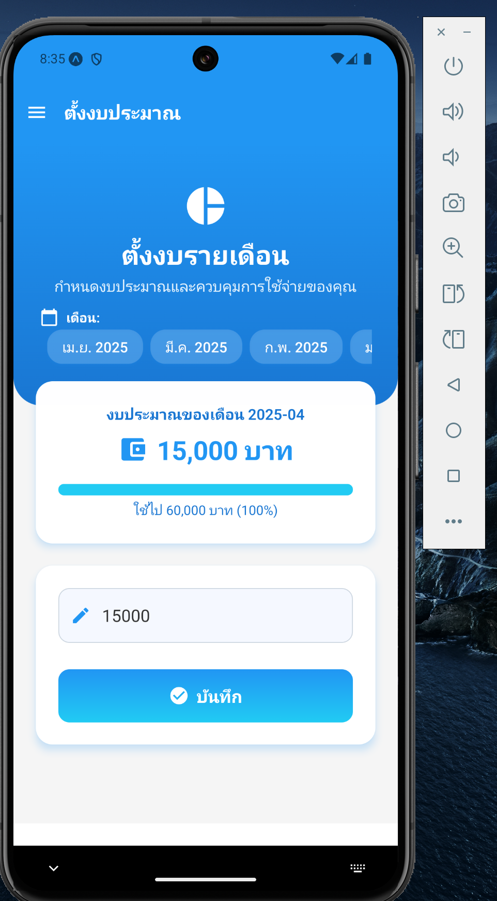
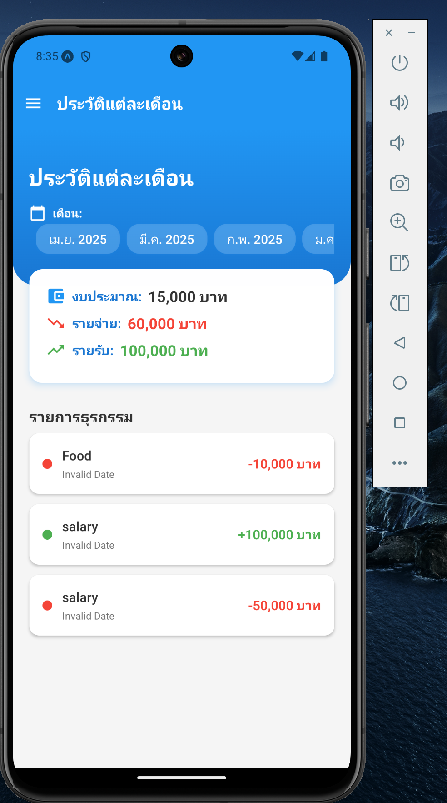
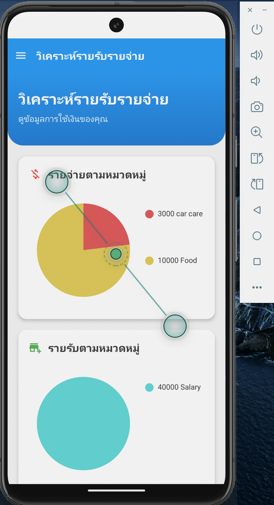

# 📱 Take-home Assignment
**ชื่อ - นามสกุล (Guan Jie Khamchan):**  
**รหัสนักศึกษา (6631503003):**  
**ชื่อแอป (SMARTFINANCE):**  
**Framework ที่ใช้ (Framework Used):** React Native Expo
**ลิงก์ GitHub Repository:** [https://github.com/Guanjie003/Take-Home-Final-Exam-]  
**ลิงก์ไฟล์ติดตั้ง (APK/IPA):** [https://expo.dev/artifacts/eas/5W3VE4A7jDZqQL2WYNdVau.apk]

---

## 1. การออกแบบแอป | App Concept and Design (2 คะแนน / 2 pts)

### 1.1 ผู้ใช้งานเป้าหมาย | User Personas  

```markdown
Persona 1:  
- ชื่อ: ปลื้ม  
- อายุ: 20 ปี  
- อาชีพ: นักศึกษาปี 2  
- ความต้องการ: ต้องการจัดการเงินให้มีวินัยมากขึ้น

Persona 2:  
- ชื่อ: มะนาว  
- อายุ: 20 ปี  
- อาชีพ: นักศึกษาปี2  
- ความต้องการ: ต้องการวางแผนการเงินเก็บเงินไว้ตอนทำงาน
```

### 1.2 เป้าหมายของแอป | App Goals  
**ตัวอย่าง (Example):**
```markdown
- ช่วยนักศึกษาและคนวัยทำงานจัดการเรื่องการเงิน
- ทำให้มีเงินออมได้ดีขึ้น
- คำนวนรายได้รายจ่ายรายเดือน
```

### 1.3 โครงร่างหน้าจอ / Mockup  
**ใส่รูปภาพ หรือคำอธิบายแต่ละหน้าหลัก 3 หน้า | Attach image or describe 3 main pages**

** Buget Screens **
หน้านี้สามารถกำหนดงบที่จะใช้เดือนนี้จะใช้ไม่เกินกี่บาท

** History Screens **
หน้านี้จะสามารถดูประวัติการเงินของเราแต่ละเดือน

** Saving Screens **
หน้านี้สามารถสร้างหมวดหมู่เงินออมจะออมเงินใส่อะไรบ้าง

### 1.4 การไหลของผู้ใช้งาน | User Flow  
**ตัวอย่าง (Example):**
```markdown
เปิดแอป > เข้าหน้าแดชบอร์ด > เลือก "เพิ่มรายการ" > บันทึก > เพิ่มรายการรายได้รายจ่าย
เปิดแอป > เข้าหน้าแดชบอร์ด > กด  side bar เลือก "เป้าหมายการออม" >  > กด เพิ่มเป้าหมาย
เปิดแอป > เข้าหน้าแดชบอร์ด > กด  side bar เลือก "วิเคราะห์รายรับรายจ่าย"
เปิดแอป > เข้าหน้าแดชบอร์ด > กด  side bar เลือก "ตั้งงบประมาณ" >  > กด บันทึก
เปิดแอป > เข้าหน้าแดชบอร์ด > กด  side bar เลือก "ประวัติแต่ละเดือน" >  > กด ดูแต่ละเดือน
```

---

## 2. การพัฒนาแอป | App Implementation (4 คะแนน / 4 pts)

### 2.1 รายละเอียดการพัฒนา | Development Details  
**เครื่องมือที่ใช้ / Tools used:**
```markdown
- react-native@0.79.1
- Package:  
    "@expo/vector-icons": "^14.0.2",
    "@react-navigation/bottom-tabs": "^7.3.10",
    "@react-navigation/drawer": "^7.3.9",
    "@react-navigation/native": "^7.1.6",
    "@react-navigation/native-stack": "^7.3.10",
    "@react-navigation/stack": "^7.2.10",
    "expo": "~52.0.46",
    "expo-linear-gradient": "~14.0.2",
    "expo-notifications": "~0.29.14",
    "expo-status-bar": "~2.0.1",
    "firebase": "^11.6.0",
    "react": "18.3.1",
    "react-native": "0.76.9",
    "react-native-chart-kit": "^6.12.0",
    "react-native-gesture-handler": "~2.20.2",
    "react-native-paper": "^5.13.5",
    "react-native-reanimated": "~3.16.1",
    "react-native-safe-area-context": "^4.12.0",
    "react-native-screens": "~4.4.0",
    "react-native-svg": "^15.8.0",
    "react-native-vector-icons": "^10.2.0",
    "react-navigation": "^5.0.0"
```

### 2.2 ฟังก์ชันที่พัฒนา | Features Implemented  
**Checklist:**
```markdown
- [x] เพิ่มรายการรายรับ | รายจ่าย
- [x] เพิ่มเป้าหมายของการออมเงิน
- [x] ดูผลลับพ์รายรับรายจ่ายรายของเดือนปัจจุบัน
- [x] ตั้งงบประมาณของแต่ละเดือน
- [x] ประวัติรายรับรายจ่ายแต่ละเดือน
```

### 2.3 ภาพหน้าจอแอป | App Screenshots  
**แนบภาพหรือ URL (Attach images or image links):**
```markdown
- 
- 
- 
- 
- 
- 
```

---

## 3. การ Build และติดตั้งแอป | Deployment (2 คะแนน / 2 pts)

### 3.1 ประเภท Build | Build Type
- [x] Debug  
- [ ] Release  

### 3.2 แพลตฟอร์มที่ทดสอบ | Platform Tested  
- [x] Android  
- [ ] iOS  

### 3.3 ไฟล์ README และวิธีติดตั้ง | README & Install Guide  
**แนบไฟล์หรือคำอธิบายการติดตั้งแอป | Insert steps**
```markdown
1. ดาวน์โหลดไฟล์ .apk
2. เปิดในอุปกรณ์ Android
3. ติดตั้งผ่าน File Manager
```

---

## 4. การสะท้อนผลลัพธ์ | Reflection (2 คะแนน / 2 pts)

**ตัวอย่างหัวข้อ | Suggested points:**
```markdown
- พบปัญหาเวลาใช้ setState กับ async function
- เรียนรู้การใช้ Provider ในการจัดการสถานะ
- หากมีเวลา จะเพิ่มฟีเจอร์ login และ Firebase sync
```

---

## 5. การใช้ AI ช่วยพัฒนา | AI Assisted Development (Bonus / ใช้ประกอบการพิจารณา)

### 5.1 ใช้ AI ช่วยคิดไอเดีย | Idea Generation
```markdown
Prompt ที่ใช้:  
"Can you help me think idea about saving buget apps"

ผลลัพธ์:  
ช่วยเสริมไอเดียและได้เพิ่ม Function เพิ่มในแอพ
```

### 5.2 ใช้ AI ช่วยออกแบบ UI | UI Layout Prompt
```markdown
Prompt ที่ใช้:  
"Give me the colour theme that will be fit the saving buget apps."

ผลลัพธ์:  
ได้ธีมสีให้เลือกและเอาไปผสวผสานกัน
```

### 5.3 ใช้ AI ช่วยเขียนโค้ด | Code Writing Prompt
```markdown
Prompt ที่ใช้:  
"Flutter code to create a ListView with editable schedule items."

ผลลัพธ์:  
นำไปปรับกับ logic ของแอป เพิ่มปุ่มแก้ไข
```

### 5.4 ใช้ AI ช่วย debug | Debug Prompt
```markdown
Prompt ที่ใช้:  
"Can you help me find the bug and debug it and tell me where is the bug and why"

ผลลัพธ์:  
AI ให้คำแนะนำและวิธีแก้ไข bug ที่เกินขึ้น
```

### 5.5 ใช้ AI ช่วย Deploy | Deployment Prompt
```markdown
Prompt ที่ใช้:  
"How to build React Native expo as APK and test on Android?"

ผลลัพธ์:  
คำสั่ง React Native expo build apk --release พร้อมวิธีติดตั้ง
```

---

## ✅ Checklist ก่อนส่ง | Final Checklist
- [x] กรอกข้อมูลครบทุก Section  
- [x] แนบ GitHub และไฟล์ติดตั้ง  
- [x] สะท้อนผล และใช้ AI อย่างมีเหตุผล  
